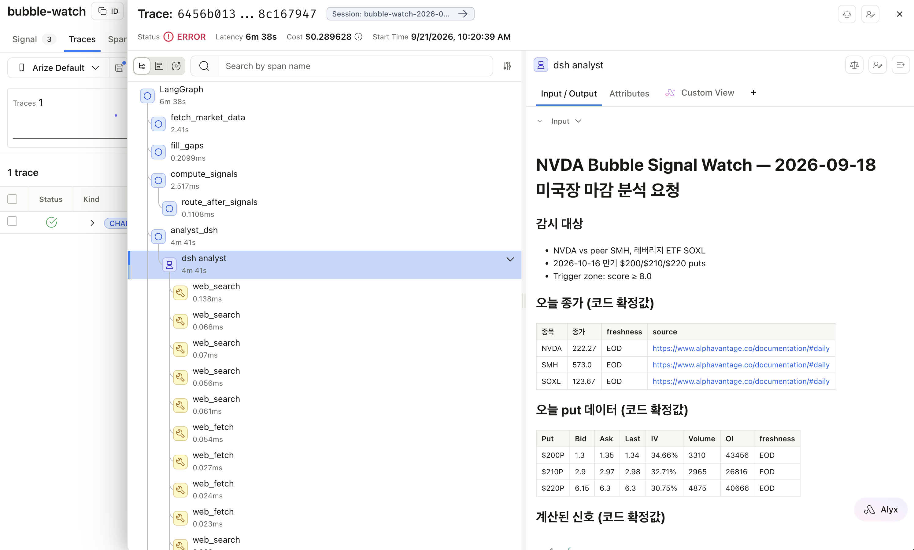
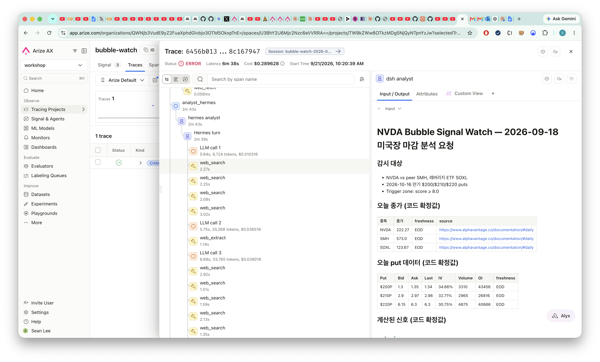

# Arize × LangGraph × Hermes Agent × DeepSeek Harness

A worked example of **orchestrating two heterogeneous agent runtimes from LangGraph, with one trace across
all three**. The runtimes were not designed to be embedded: Hermes Agent is a Python CLI, DeepSeek Harness
(`dsh`) is a TypeScript/Node harness driven over JSON-RPC. Both run here as analyst sub-agents on Grok 4.6,
behind a single contract, traced to Arize AX.

The concrete use case is a daily "NVDA Bubble Signal Watch" report in Korean, but the domain is incidental —
the reusable parts are the orchestration, the agent contract, and the tracing.


```
fetch_market_data (Alpha Vantage) → fill_gaps (Hermes) → compute_signals
  → hermes_analyst ∥ dsh_analyst → reconcile ─┬→ write_report → save_state
                                   ↑ rebuttal ←┘ (only on disagreement)
```

**Deterministic core, agents at the edges.** Every number in the report is computed in Python nodes; the
agents contribute web research, cited catalysts and judgment. That keeps the whole graph testable offline
against fake agents.

**One contract per runtime.** Both analysts implement `analyze(brief) -> AnalystResult`: schema-validated
output (Pydantic), one corrective retry inside the same agent session, and a single-analyst fallback when one
fails. The graph does not know which runtime is behind them. Scores within 0.5 and the same verdict count as
agreement; otherwise each analyst sees the other's view once (the rebuttal round) before code reconciles them.

## What each integration actually took

| | Hermes Agent | DeepSeek Harness (`dsh`) |
|---|---|---|
| Integration | one-shot CLI subprocess per call (`hermes chat -Q`) | Python SDK → JSON-RPC over stdio |
| Returns | final text on stdout, session id on stderr | structured event stream (tool calls, args, results) |
| Isolation | `HERMES_HOME` = `.hermes-analyst/` (own config, web-only toolset, plugins) | `DSH_HOME` = `.dsh/` + profile |
| Model wiring | `--provider xai -m grok-4.6` | xAI registered through its `llm-pi-ai` adapter in `settings.yaml` |
| Web search | Tavily, native | no Tavily backend → `dsh/plugins/web-search-tavily.mjs` (dependency-free `WebSearchProvider`, loaded via a generated patch layer) |
| Tracing | traces itself; `observability/arize` plugin parents its turn on a W3C `traceparent` | TOOL spans rebuilt from the returned events |

## Setup

Requires Python 3.13 (`uv`), Node ≥ 22.19 for dsh, and local checkouts of both agent runtimes.

1. `uv sync`
2. **dsh runtime** — build your DeepSeek Harness checkout under Node ≥ 22.19:
   `PATH=~/.nvm/versions/node/v24.21.0/bin:$PATH pnpm install && pnpm run build`.
   `bin/dsh` launches the built CLI (`DSH_NODE` / `DSH_REPO` override the paths). Launching the TS source via
   `tsx` mixes src/lib plugin copies and every tool call fails, so the built CLI is used deliberately.
3. **Hermes runtime** — `bin/hermes` runs the **repo checkout** (`$HERMES_REPO/.venv/bin/hermes`, default
   `~/projects/hermes-agent`), not an installed `hermes`: the checkout has the Tavily web backend and the
   `observability/arize` plugin. Run `uv sync` there once, plus `uv pip install arize-otel`.
4. `cp .env.example .env` and fill in: `XAI_API_KEY`, `TAVILY_API_KEY`, `ALPHA_VANTAGE_API_KEY`, and the
   `ARIZE_*` keys for tracing. No Hermes API key is needed in the default (one-shot) mode.
5. `uv run bubble-watch seed` then `uv run bubble-watch doctor` — doctor reports variable **names** only.

The first Hermes call writes `.hermes-analyst/` with a Grok model config, the `web` toolset only, the tirith
pre-exec scanner disabled (no shell tools to scan) and the Arize plugin enabled. Your own `~/.hermes` and its
messaging platforms are never touched: platform credentials are stripped from the subprocess environment.

For a remote Hermes (e.g. on EC2), set `HERMES_MODE=gateway` and run `uv run bubble-watch hermes-gateway`
there; the HTTP client path is kept for that case.

## Run

```bash
uv run bubble-watch run --date 2026-09-18            # report → reports/2026-09-18-NVDA.md, state saved
uv run bubble-watch run --date 2026-09-18 --dry-run  # report only
uv run bubble-watch run --no-agents                  # data + signals only, no LLM calls
uv run bubble-watch doctor                           # keys, runtimes, model availability
```

## Tracing

One run is one trace in the Arize project `bubble-watch` (`session.id = bubble-watch-<date>`). **Open the
trace, not the session**: Hermes' spans carry Hermes' own session id, so a session-filtered view hides them.

dsh's tool calls are reconstructed from the SDK event stream, so `web_search` / `web_fetch` appear with their
arguments and results:



Hermes traces itself: the `observability/arize` plugin receives a W3C `traceparent` per call and parents its
turn on the caller's span, so `Hermes turn`, its LLM calls (with tokens and cost) and its tool calls nest
under `hermes analyst`:



Three mechanisms, because each runtime exposes a different seam: LangGraph is auto-instrumented
(`openinference-instrumentation-langchain`), dsh's spans are rebuilt from events, and Hermes' come from the
agent itself across a process boundary. Trace status is ERROR when any span failed, including one recoverable
tool error (a page that refuses to load); the run still completes.

Tracing is optional — without `ARIZE_*` credentials everything runs with a no-op tracer.

## Data rules

Alpha Vantage EOD is the single source for closes and option chains (any past date). yfinance is used only
when no Alpha Vantage key is set. Every value carries a freshness label (`EOD`, `latest_snapshot`,
`late_session_last`, `derived`, `N/A`); a missing value stays `N/A` and is never estimated. Gaps are filled by
the Hermes analyst, which must return a source URL and freshness per value or the fill is rejected.

Alpha Vantage reports IV on a ~0.98%p grid, so a rise within one step is reported as "can't tell" rather than
a signal.

## Layout

```
src/bubble_watch/
  graph.py        LangGraph wiring (nodes, parallel analysts, conditional rebuttal)
  agents/         base.py (contract, JSON extraction, retry) · hermes_cli.py · dsh_client.py · prompts.py
  market_data/    alphavantage.py (primary) · yfinance_provider.py (fallback) · base.py (gaps)
  signals.py      pure signal computation      reconcile.py  pure agreement/merge rules
  facts.py        Korean fact sheet + formatting shared by report and writer
  report.py       markdown tables from code    writer.py     narrative via xAI
  tracing.py      Arize setup, agent spans, dsh event → span builder
dsh/              web-search.patch.yml template + plugins/web-search-tavily.mjs
bin/              hermes, dsh launchers
docs/             design spec, implementation plan, diagrams
```

## Tests

`uv run pytest -q` — 78 tests, no network. The graph runs end-to-end against fake analysts and fake market
data (agreement, rebuttal, single-analyst fallback, total failure, dry run). The dsh Tavily plugin is tested
under Node with a mocked `fetch`.

## Status

The pipeline runs daily and produces the report; it is analysis, not trade advice. A backtest of the report's
own entry logic (2022–2026 NVDA options) did **not** support it as a timing rule, so no entry/exit decision is
emitted — see `docs/specs/` for the design and the open questions.
