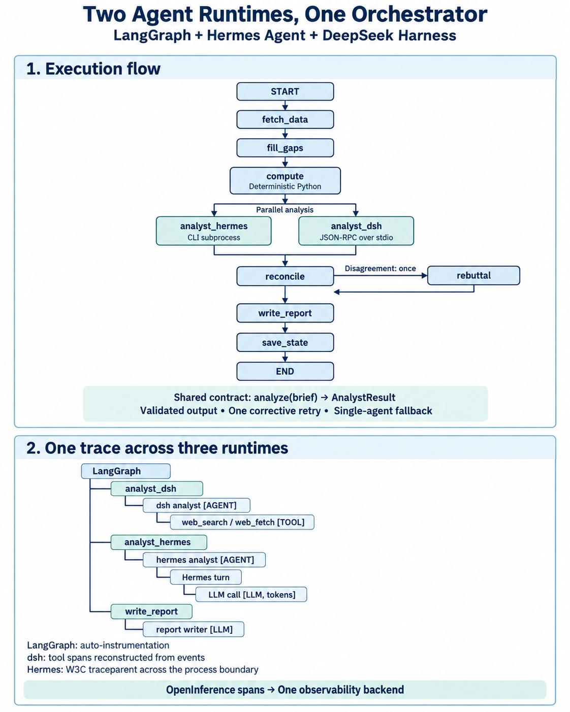

# Bubble Watch

Daily "NVDA Bubble Signal Watch" (Korean) produced by a LangGraph pipeline with two independent analyst
sub-agents — **Hermes Agent** (one-shot CLI) and **DeepSeek Harness** (Python SDK) — both on Grok 4.6.
Every number in the report is computed in code; the agents contribute research, cited catalysts and
judgment, reconciled in code (one rebuttal round when they disagree). Both analysts search the web with
Tavily (Hermes natively; dsh through `dsh/plugins/web-search-tavily.mjs`, since dsh ships no Tavily backend).
Traced to Arize AX.



```
fetch_market_data (Alpha Vantage) → fill_gaps (Hermes) → compute_signals
  → hermes_analyst ∥ dsh_analyst → reconcile ─┬→ write_report → save_state
                                   ↑ rebuttal ←┘ (only on disagreement)
```

Both analysts sit behind one contract (`analyze(brief) -> AnalystResult`), so the graph does not care which
runtime is behind them: schema-validated output, one corrective retry in-session, and a single-analyst
fallback when one fails. Observability differs per runtime — LangGraph is auto-instrumented, dsh's tool
spans are rebuilt from its event stream, and Hermes traces itself through a W3C `traceparent` passed across
the process boundary — but every span lands in one trace.

## Setup

1. `uv sync`
2. dsh runtime: build your DeepSeek Harness checkout under Node ≥ 22.19
   (`PATH=~/.nvm/versions/node/v24.21.0/bin:$PATH pnpm install && pnpm run build` in `~/projects/deepseek-harness`).
   `bin/dsh` launches it with Node 24 (`DSH_NODE` / `DSH_REPO` override the paths).
3. Hermes (installed `hermes` CLI) needs no setup: each analyst call runs `hermes chat -Q` in an isolated
   `HERMES_HOME` (`.hermes-analyst/`: model `grok-4.6` via `xai`, web tools only, tirith off), with keys passed
   from this project's `.env`; your main `~/.hermes` and its messaging bots are never touched.
   For a remote Hermes (e.g. EC2), set `HERMES_MODE=gateway` and run `uv run bubble-watch hermes-gateway` there.
4. `cp .env.example .env` and fill in the keys (do this before step 3): `XAI_API_KEY` and `TAVILY_API_KEY`.
5. `uv run bubble-watch seed` then `uv run bubble-watch doctor`.

## Run

```bash
uv run bubble-watch run --date 2026-09-18            # report → reports/2026-09-18-NVDA.md, state saved
uv run bubble-watch run --date 2026-09-18 --dry-run  # report only
uv run bubble-watch run --no-agents                  # data + signals only, no LLM calls
```

Traces: Arize project `bubble-watch` (one trace per run, `session.id = bubble-watch-<date>`). The Hermes
analyst span carries `hermes.session_id`, which links to Hermes' own trace in the `hermes-agent` project.
dsh tool calls appear as TOOL spans rebuilt from the SDK events (no per-tool timing).

## Data rules

Values carry a freshness label (`EOD`, `latest_snapshot`, `late_session_last`, `derived`, `N/A`). Missing values
stay `N/A` — never estimated; web gap fills need a source URL. yfinance has no historical option chains, so
past-date put data comes from Alpha Vantage (if configured) or the Hermes gap fill.
